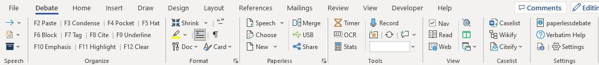

# Paperless Debate Manual

This site contains documentation for [Verbatim](https://paperlessdebate.com) and associated tools.

Verbatim is a free, open-source (GPL3) platform for paperless debate, with a variety of supporting tools and plugins. The desktop version is built as a template for Microsoft Word and Microsoft Excel. It's primarily designed for usage in US-based high school and collegiate policy debate, but is usable by many other debate formats including Lincoln-Douglas, Public Forum, etc.

Verbatim also comes with a built-in tutorial to teach you how to use it. But if you’re looking for more advanced instruction and tips, the online manual will walk you through every feature.

For more information or to download the latest version, see the [Paperless Debate](https://paperlessdebate.com) homepage.

To get started, follow the [Installation](verbatim/getting-started/installation) instructions.
