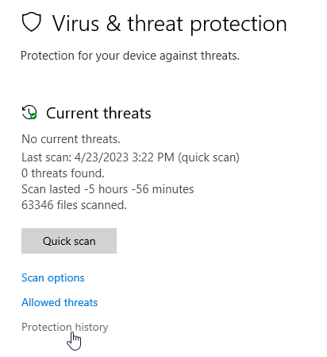

# Verbatim and Antivirus

Verbatim is often flagged as a false postive by antivirus programs, including Microsoft Defender. This is because it makes use of Visual Basic for Applications (VBA) Macros, which are also commonly used by some kinds of viruses and trojans. Verbatim also includes code for things like sending files to the caselist or checking for updates, which look suspicious to the heuristics used by automated scanners to detect malware.

There is nothing harmful in Verbatim, and it's not a virus. It's completely open source, so you're welcome to inspect the code yourself to verify.

You can also try Verbatim Mini, which is a stripped down version of Verbatim with all the core functionality, but with features removed (like Tabroom integrations and automatic updates) that are most likely to trip antivirus scanners. If you’re having issues with the full version or have particularly restrictive school IT, try this version. For more information, see the [Installation](./installation) page.

Each new release of Verbatim is submitted to antivirus companies for approval, so the false postives are usually temporary. But if you're still getting a false positive, your best bet is to tell your antivirus software to allow Verbatim. You may need to reinstall Verbatim after doing so.

Problems with your antivirus may not be immediately apparent, and may manifest themselves as none/some of the macros failing to run, errors about permissions with Debate.dotm, errors when saving your settings, or a variety of other issues.

## Windows Defender

You may not realize Windows Defender has blocked Verbatim, as it has started silently deleting macros from the template file without notification. False positives may also not happen until after you have installed Verbatim and are using files or saving your settings. You may need to manually check your "Protection History" to allow Verbatim, and you may have multiple virus alerts for different viruses in a row before it will stop flagging it.

It's also highly likely you will get multiple false detections, which may be for different files associated with Verbatim, such as:
* Debate.dotm
* vbaProject.bin
* temp files like ~WRD00001.tmp

You may want to consider adding an exclusion in Defender for your entire Templates folder, or individually adding each separate file that gets flagged.

[How to Add an Exclusion to Windows Defender](https://support.microsoft.com/en-us/windows/add-an-exclusion-to-windows-security-811816c0-4dfd-af4a-47e4-c301afe13b26)

You should reboot your computer after allowing Verbatim in Windows Defender, as it may still have a permissions lock on Debate.dotm and not allow you to use Verbatim until you've restarted.

First, ensure you've updated Microsoft Defender to the latest security definitions. Verbatim is usually marked as allowed in the most recent definitions.

After installing and opening Verbatim, check your Windows Defender protection history:

If you have an alert about Debate.dotm, vbaProject.bin, or temp files in your Templates folder, use the Actions menu for the alert to "Allow" or "Restore" the file, depending on what the scanner did to block it. Then, reboot. You may also need to try reinstalling Verbatim to restore the template file, and may have to repeat the steps multiple times if you get more than one virus alert.
