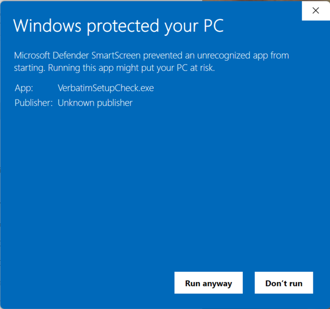

# Security

Because Verbatim is a Word template which relies on Visual Basic for Applications (VBA) Macros to function, how you install and run Verbatim has implications for the security of your Office installation.

Verbatim itself is completely safe. It is not a virus, and it contains no malicious code. It is open source and has been downloaded hundreds of thousands of times with no security issues.

However, depending on how you set up your macro security settings in Word while using Verbatim, you may open yourself to other people’s malicious code. For example, if you set your macro security to allow running all macros without notification, you wouldn't want to open a Word document from an untrusted source on the internet that may have malicious code in it.

For more information on the different options, see the section on security settings below.

## Setup Tools

There are Setup Check tools available for both PC and Mac on the downloads page, which are designed to allow you to quickly monitor and toggle your macro security settings for use with Verbatim. For example, these tools would allow you to lower your macro security temporarily while debating in a round, then turn it back up aftewards to be more secure.

For example, on the PC, you can use the dropdown box to switch between macro security levels:

On the Mac, it will let you toggle your macro security settings:

On Windows, running the Setup Check tool may give you a Windows Defender prompt, where you'll have to click "More Information" and then "Run anyway:

You may also be prompted to download and install the .NET runtime:

## Security Settings

Ultimately, balancing ease of use and security is up to you, and you should be informed about the tradeoffs.

There are 3 types of security settings used by Microsoft Word which impact how you use Verbatim. You can change all 3 settings under File – Options – Trust Center – Trust Center Settings. Alternately, you can use the Verbatim Setup Check tools on the downloads page to quickly modify your security settings.

Previous versions of the Verbatim installer defaulted to changing these settings for you as part of the installation process unless you opted out. Now, the installer is “secure by default,” so you’ll have to manually opt-in to changing these settings, whether using the Verbatim installer or making these changes yourself.

### Macro security & VBOM Access

By default, Word enables “Macro Security” to prevent running macro code by people you don’t know. You may see a warning like this when opening Verbatim:

This requires you to click “Enable Content” on every file containing macros (e.g. every Verbatim file you open). That gets old fast, so many people turn their macro security to “low,” i.e. “Enable all macros” to make this prompt go away. This is more convenient, but means Word will run any macros someone sends to you, even if they have embedded a malicious non-Verbatim macro into a file. If you choose to run Word with “low” macro security, make sure you trust any person sending you files.

Additionally, you can choose to select “Trust Access to the VBA project object model.” This setting is necessary for some Verbatim macros to function, such as the “Verbatimize/Always On” feature. The downside is that someone sending you malicious code could potentially insert macros into your “normal” Word template while this option is enabled.

### Protected View

Word has another layer of security enabled by default called “Protected View.” When enabled, you may see warnings like this:

Again, this would require you to click the “Enable Editing” button on every Verbatim file you open that you didn’t create yourself. Because that can be frustrating, many users choose to disable Protected View:

The downside of enabling Protected View is, again, that someone could send you malicious non-Verbatim macro code that would run without any security prompts.

Bottom line, balancing the security and ease of use of your Verbatim installation is up to you. The Verbatim installer and some functions inside Verbatim may give you options to change these settings in an automated way, but you will need to decide for yourself which ones to enable or disable.
