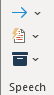
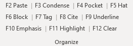
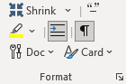
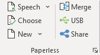
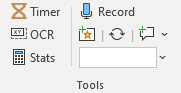
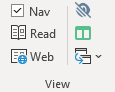

For experienced users or those wanting to jump right in to using Verbatim here's an overview of the key commands on each Ribbon section:

### Speech

The Speech section of the Ribbon is used to help construct the Speech document you'll read during your speech. The blue arrow menu contains different options for quickly transferring parts of your document to your Speech or your Flow.

The Quick Cards menu lets you configure shortcut words you can type, then press a keyboard shortcut to automatically replace the shortcut word with an entire card/block

The Virtual Tub lets you insert blocks directly from files in your tub without needing to open the file itself.

### Organize

The Organize section of the ribbon contains shortcuts to format different parts of your file. Use each of the four major heading levels (Pocket, Hat, Block, Tag) to divide your cards into a logical heirarchy. Then, use the rest of the functions to format the cards themselves with e.g. underlining or highlighting. To clear all formatting on the current text, use F12.

### Format

The Formatting section of the ribbon contains functions that help you quickly format your document or individual cards. The "Shrink" functions shrink the non-underlined text in your card to make it easier to read during your speech.

The "paragraph integrity" buttons let you toggle whether to use pilcrows or retain paragraphs when condensing multiple paragraphs into a single card.

The Doc menu contains functions which format large portions of your document at once, such as fixing bad formatting, or automatically numbering your blocks.

The Card menu contains functions which format individual cards, such as standardizing the highlighting color, or quickly duplicating cites.

### Paperless

The Paperless section of the menu has functions relevant for in-round debating.

The Speech menu lets you create a new Speech document for sending cards/blocks to. If you have multiple Speech documents open, you can use the Choose button to select the active speech.

The New menu lets you create a new Verbatim document or flow.

The Merge button is used to combine multiple documents into one (e.g. assembling a post-round document for the judge from different speech documents).

The USB and Share functions help you share your speech document with your opponent/judge quickly, including via share.tabroom.com, which can share your file without needing to manually email it.

### Tools

The Tools section contains small helpful utilities.

The Timer button will launch an on-screen timer if you have the Verbatim Plugins installed.

The OCR button will let you take a screenshot of a portion of your screen (e.g. a PDF), and will paste the converted text in your document.

The Stats button shows some key statistics about your current document, including estimating how long it will take you to read.

The Record button will start an audio recording on your computers microphone to easily record your speech.

The Search box will search your files for a keyword, which you can open directly from the menu.

### View

The View section let's you quickly adjust your screen setup, including whether to display the Navigation Pane, or whether to use Reading view for quicker scrolling.

It also has an "invisibility mode" function to make reading cards easier, and a window arranger to make constructing a speech document easier.

### Caselist

The Caselist section is for preparing your document for upload to the caselist at opencaselist.com. The Wikify and Citeify functions convert your document into a caselist-friendly format. The Caselist button can automate the process and upload directly to the website from Word.

### Settings

The Settings section has links for the built-in Help/Tutorial, a cheat sheet of keyboard shortcuts, and the main Verbatim Settings to customize your setup.
