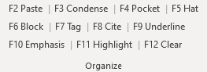
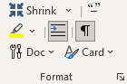

# Formatting Functions

Verbatim has dozens of functions to help you format your cards and document. Many functions also have different modes depending on what text you have selected, where your cursor is located, etc. This section explains the most common formatting features, most of which are located on the Organize or Format sections of the ribbon.

The default keyboard shortcut for each function is shown in parentheses.

## Selection Modes

Most formatting macros operate with a similar priority order for deciding what portion of the document to operate on, where applicable:

1. Always respect user selection where possible. If text is selected, the macro will operate on that

2. Otherwise, operate on the current heading - if in a card or on a tag, just operate on that card

3. If on a larger heading (Pocket, Block, Hat), operate on that heading level

4. If at the very beginning of the document, operate on the entire document

## Core Formatting Functions

The most commonly used formatting features are on the Organize section of the ribbon.

### Paste Text (F2)
This will paste text from the clipboard as “unformatted” text. This should almost always be used rather than Ctrl+V for pasting in card text. A failure to use unformatted text will quickly add extraneous headings and styles, making the Navigation Pane unusable and slowing down your document.

### Condense (F3)
This removes white space from the current selection or card, while optionally retaining paragraph integrity. By default, the paragraph integrity settings will replace each hard return with a small “pilcrow” paragraph sign (¶). This results in a single block of text, with small pilcrows scattered throughout at the original paragraph breaks. Alternately, it is possible to retain paragraph integrity while not using the pilcrows – the macro will then only eliminate extraneous white space. If “retain paragraph integrity” is turned off entirely, it will just condense the text to a single paragraph.

When cutting a PDF or similarly formatted document which includes line breaks after each line of text in a single paragraph, retaining paragraph integrity will result in too many pilcrows being inserted. The solution is to temporarily turn off the “retain paragraph integrity” setting while cutting that article, then turn it back on.

There are two toggle buttons in the Format section of the ribbon, which allow you to quickly switch between retaining paragraphs or using pilcrows. Alternately, there are dedicated keyboard shortcuts for each mode:

* `F3` - Condense with current mode
* `Ctrl/Cmd + F3` - Condense No Pilcrows
* `Ctrl/Cmd + Alt + F3` - Condense With Pilcrows

### Cite (F8)
The cite style is designed to be applied only to the last name and date – unlike the “tag” style it only applies to a single word or set of characters, not to the whole line.

### Underlining (F9)
Underlines the selected text. You can configure whether to bold underlined text as well in the Verbatim settings. The underline macro is also written to “toggle” between underlined and un-underlined text. This makes it easy to quickly correct underlining mistakes on the fly.

There is also an included "Underline Mode" button in Format section of the ribbon – when turned on, this will immediately toggle the underlining for any highlighted text, without needing to press an additional shortcut key.

### Emphasis (F10)
By default, Emphasis will add a box around the current selection. Whether to use a box or just leave text bold (or larger) can be configured in the Verbatim settings.

### Highlight (F11)
Highlight will toggle the highlighting of the current selection on and off using the default highlighting color. The default color can be set with the “highlight color picker” on the ribbon. It is strongly recommended that you not use “light gray” as the highlight color. There is a known bug in Word which sometimes “loses” highlighting in saved files when this color is used.

### Clear Formatting (F12)
The Clear Formatting function will completely remove any formatting from the selection and return it to Normal text. The only thing it doesn’t remove is highlighting – this can be removed separately by toggling it with the highlighting function. When facing an intractable formatting problem, it is usually quickest to just clear the formatting of the offending text and start over.

## Shrink Font (Alt + F3 or Ctrl/Cmd + 8)
The Shrink functions shrink un-underlined parts of the current selection or card by progressively smaller font sizes, until it cycles back to the normal font size. 

The Shrink menu in the Format section includes additional options, including functions to Shrink or Unshrink all cards in the document, or to shrink pilcrows from condensing that have been accidentally underlined.

By default, Shrink will not shrink text in the card if formatted as an omission note. An omission note is text between either square brackets [], or angle brackets \<\>, with a word describing the omission, and the word "Omitted." Note that omission notes are case sensitive. So, for example, these are all valid omission notes:

`[ Table Omitted ]`

`[ Figure Omitted ]`

`< Image Omitted >`

`< Nothing Omitted >`

This behavior can be disabled in the Verbatim settings.

## Doc Menu

The Doc menu in the Format section contains macros which either bulk format a large portion of the document or remove unwanted parts of the document.

### Automatic Fixers

These macros fix various formatting issues throughout the document

#### Fix Fake Tags
Detects tags which people have formatting (inadvertently or just to be annoying) without using the Tag style (e.g. using the Cite style or manually bolding the text). It will convert all instances it finds into the Tag style

#### Convert Analytics To Tags
Similar to the above, converst paragraphs formatted with a custom "analytics" style into Tags instead. For a discussion of analytics styles and why Verbatim doesn't include one, see the [FAQ](../faq).

#### Fix Formatting Gaps
Fixes weird gaps in underline/emphasis formatting in cards caused by mistakes while applying styles.

#### Convert To Default Styles
Attempts to convert any non-standard styles in the document into built-in styles. This can be useful when e.g. dealing with poorly formatted file from someone else, or when someone didn't use F2 when pasting text and Word created a bunch of weird styles from pasted webpage content.

#### Remove Extra Styles
Removes non-builtin styles from the Document entirely, which helps clear up the Styles gallery on the Word ribbon. Should only be run after first running "Convert To Default Styles."

#### Auto Number Tags (Ctrl/Cmd + #)
Will add numbers like 1., 2., etc. to all tags on the current block. If run at the top of the document, will do so for all blocks in the document.

#### De-Number Tags
Removes numbers from tags on the current block. If run at the top of the document, will do so for all blocks in the document.

#### Insert Header
Adds a header to each page of the document, which can be edited to add a file title, etc. Pulls information on your name/school from the Verbatim Settings. Useful if you need to print a block/file for any reason.

### Removal Tools

These macros remove unwanted content/formatting from the document.

#### Remove Emphasis
Some people overuse the emphasis function, and think every line in every card they cut is special. This replaces all emphasized text with regular underlining.

#### Remove Non-Highlighted Underlining
Removes text that is underlined, but not highlighted. Helps reduce over-underlined cards to just underline the parts that you actually want to read.

#### Remove Blanks
Deletes paragraphs in the document formatted as a heading (e.g. Pocket/Hat/Block/Tag) which have no content and appear as blank lines in the Navigation Pane.

#### Remove Pilcrows
Remove pilcrows from the document, if you have cards that were condensed using pilcrows and you no longer want them.

#### Remove Hyperlinks
Removes Word's automatic formatting of URL's into hyperlinks.

#### Remove Bookmarks
Deletes bookmarks in the current file, which have either been manually added or added as part of including the file in your Virutal Tub.

### Styles

#### Update Styles (Ctrl/Cmd + F12)
Updates the styles in the current document to match your currently configured Verbatim template styles. Is mostly useful when opening a backfile that appears incorrectly, or after pasting in a card from a different source.

#### Select Similar Formatting (Ctrl/Cmd + F2)
Will select all portions of the document with formatting similar to the current selection – for example will select all “Tags” in the document so you can apply a uniform style change. Useful for quickly reformatting large sections of the file.

#### Show All Formatting
Turns on Word's "Show Formatting Codes" feature will show symbols detailing exactly how various styles are being applied to text. Useful when trying to figure out why some portion of text just won't format the way you want to.

## Card Menu

The Card menu in the Format section contains macros which help format individual cards or bulk format cards throughout the document.

### Condense

These macros are additional options for condensing multiple paragraphs into one.

#### Condense No Pilcrows (Ctrl/Cmd + F3)
Overrides any currently selected paragraph integrity/pilcrows mode and condenses paragraphs without using pilcrows. Useful to condense text from a PDF without putting in extraneous pilcrows.

#### Condense With Pilcrows (Ctrl/Cmd + Alt + F3)
Condense with pilcrows, ignoring the current paragraph integrity/pilcrows settings. 

#### Uncondense (Ctrl/Cmd + Alt + Shift + F3)
Uncondenses the current selection or card by replacing pilcrows with the original paragraph breaks. If run at the top of the document, uncondenses all cards in the document.

### Highlighting

#### Standardize Highlighting
Converts all highlighting in the document into the currently selected highlighting color

#### Standardize Highlighting with Exception
Converts all highlighting in the document into the currently selected highlighting color, except for anything highlighted with the exception color selected in the Verbatim settings. This allows you to quickly reformat down to just 2 colors.

### Card Formatting

#### Auto-Emphasize First (Ctrl/Cmd + Alt + F10)
This will add emphasis style (e.g. a box) to the first letter of each selected word. Useful for acronym's, like *U*nited *S*tates.

#### Auto Underline Card (Alt + F9)
Attempts to underline the current card based on how you've tagged it. It's usually pretty accurate, but mileage may vary. Cursor must be in the tag.

### Cite Formatting

These functions rely on your cites being formatted according to the recommended [Cite Format](./citations).

#### Duplicate Cite (Alt + F8)
Inserts a duplicate of the previous cite, useful when cutting long articles so you don't have to manually copy and paste a cite for each card.

#### Auto Format Cite (Ctrl/Cmd + F8)
Will add Cite style to the last name and date automatically. Uses the month/day for cites in the current year, and the year for earlier cites.

#### Reformat All Cites
Switches the Cite style for all cards in the document to use the month/day for cites in the current year, and the year for earlier cites.

#### Get From Cite Creator (Alt + F2)
If using the Cite Creator extension for Chrome, will insert the computed cite from the top tab in Chrome and insert it at the cursor.
