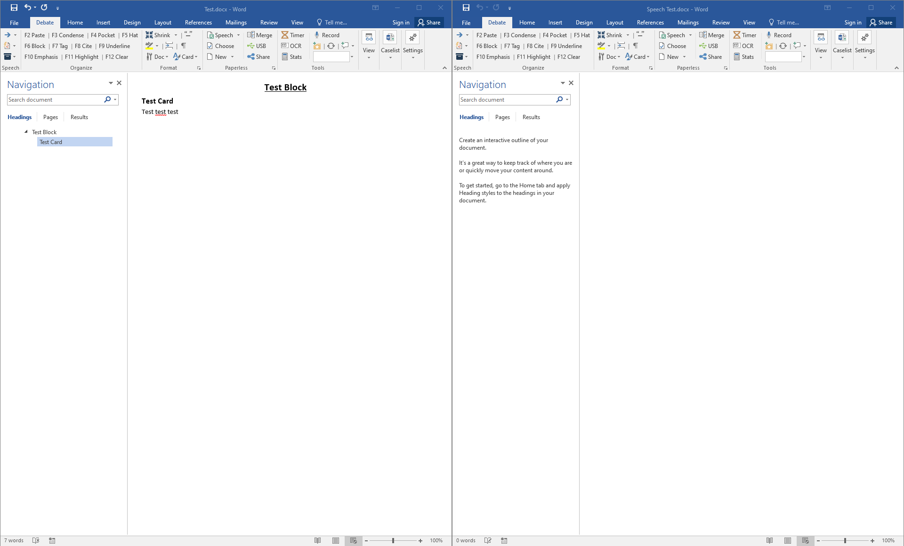
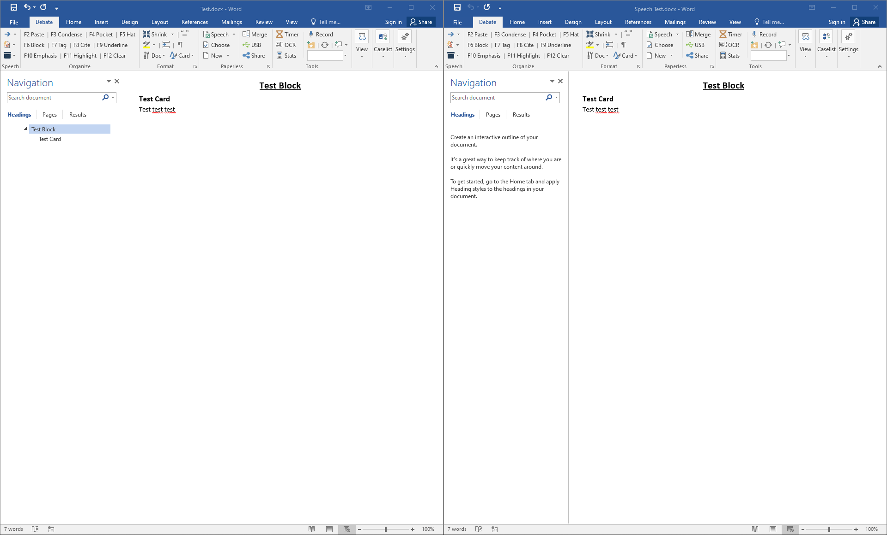
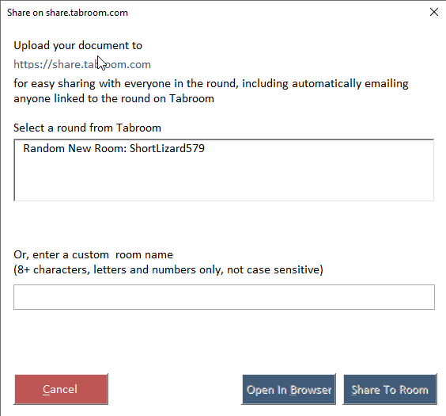

This section covers how to use Verbatim for in-round paperless debating.  The idea is very simple - You take blocks and cards from a variety of files, and put them all in one master “Speech” document, where you further organize them into the order you expect to read them in your speech.  

While you could do that by manually cutting and pasting, that's far too time-consuming to be practical, as the effort required to switch between documents, select the exact text you want to copy, and then move to the correct place to paste it would eat up an inordinate amount of prep time.

This is where the paperless macros come in.  Assembling a speech using this system is a simple five step process.

## Step One – Open a "Speech" Document

A “Speech” document is any document that contains the word “speech” somewhere in the name (not case sensitive), such as speech 2AC.docx,” “Northwestern Round 1 Speech.docx,” or even “sPeEcH Round 3 2Ac.DOCX”

A Speech document must be open for the rest of the steps to work – if it’s not, the macros will prompt you to create one. Note: If more than one document with “speech” in the name are open simultaneously, Verbatim will use the most recently opened one, or you can manually select which document to use using the "Choose" button in the Paperless section of the Ribbon

The easiest way to create a new speech document is to press the “Speech” button on the ribbon. 

This will prompt you for information about the speech you’re creating.  You are encouraged to include information here to differentiate your Speech doc from all others – speech, round, opponent, etc.

Word will then ask you where to save the new Speech document, which will automatically be named Speech + anything you typed + the current date and time.

If you have a Tabroom.com account, you can also use the dropdown menu next to the Speech button to quickly create a speech document for your upcoming rounds.

If you want, you can configure an “autosave” directory in the Verbatim Settings where all newly created speech documents will be saved – eliminating the need to manually select it each time. 

## Step Two – Open Files

Open any files you want to use from your digital tub.  This doesn’t have to all be done at once – you can open and close files as you go, as long as your Speech document remains open, you can send things to it.  Note that any files you want to use in this step must be in the Verbatim template, or have been “Verbatimized.” The picture below shows an open file on the left side of the screen, ready to send to the blank Speech document on the right.

 

## Step Three – Assemble Speech

Sending to the speech document is accomplished by pressing the `/~ key. It’s found next to the number 1 on the keyboard, and has a variety of functions depending on the context. You can also use Ctrl/Cmd + Alt + Right or press the blue arrow button in the upper left of the ribbon.

The Send To Speech key does the following:

1.  If text is selected, it sends the selected text – whether it’s one word or the whole document. 

2.  If no text is selected, it sends the current card, block, hat, or pocket – depending on where the cursor is.  

3.  If you're currently in the active speech document, it instead inserts a “Stopped reading” marker at your cursor to mark where you finished a card.

By default, sending to the speech document will paste in at the current cursor and will warn you if you try to send something to the middle of a card on accident. If you'd rather send to the bottom of the speech document, you can use the alternate keyboard shortcut Alt + \` or Ctrl/Cmd + Alt + Shift + Right.

Usually, it’s easiest to use Word’s Navigation Pane to navigate your files – if you click on a Block or Hat in the document map and then use the macro, the block you just clicked on will be sent.  

The picture below shows a block which has just been “sent” to the Speech document.

 

You can also use advanced features like [Quick Cards](./quick-cards) or the [Virtual Tub](./vtub) to efficiently assemble your speech.

## Step Four – Organize Speech

After you’ve sent as many cards or blocks as you want to your speech document, you just need to organize them as you want to have them for your speech.  There are two ways to accomplish this.

1. Use the built-in Navigation Pane by dragging and dropping headers into the correct order. Remember that Pockets are Heading 1, Hats are Heading 2, Blocks are Heading 3, and Tags are Heading 4, so they’ll appear in a logical hierarchy that can easily be collapsed or expanded.  Right-clicking on the navigation pane will also allow you to “Show Heading Levels” to whatever level is most convenient.  Unfortunately, there’s no way to write a keyboard shortcut to expand or collapse levels using macros, but on the PC there is an included NavPaneCycle [Plugin](../advanced/plugins) that can do this for you.

2. Keyboard shortcuts - `Ctrl/Cmd + Alt + Up` moves a Pocket/Hat/Block/Card up one level in the document hierarchy, and `Ctrl/Cmd + Alt + Down` does the inverse.  Note that you can’t move a card above or below the current block using the keyboard – but you can while dragging in the Nav Pane.

There’s also a macro which will delete the current card, block, hat, or pocket. By default, this is `Ctrl/Cmd + Alt + Left`. This allows you to quickly remove items which you determine in the process of organization that you’d rather not have in the Speech document.

Taken together, these three macros let you quickly move blocks into whatever order you would like them for the speech.  

Keep in mind you can also organize blocks in the Speech document, change tags, highlight cards, etc...and then return to sending more cards later. In practice, steps three and four blur together quite a bit.

## Step Five – Share Your Speech

Once your Speech document is complete, organized, and you’re ready to speak, you just need to send the file to everyone else in the room. You can do this automatically via share.tabroom.com, using a USB drive, or manually send it via email.

### Share via share.tabroom.com

The best way to transfer your file is using [share.tabroom.com](https://share.tabroom.com). This lets you securely share your file without giving anyone your private email address, and makes it easy to share a link with judges, coaches, scouts, etc. If you're attending a Tabroom tournament with the feature enabled, this will even automatically email everyone else in the room with a copy. To share via share.tabroom.com, click the "Share" button on the ribbon or press `Ctrl/Cmd + Alt + S` and use the upload form:

### Share via USB

First, you should always remember to save the working Speech document before starting the transfer – that way if something crashes you still have a complete copy.  It’s also important to save the document to your local hard drive first, not directly on a USB drive.  This is because Word tends to get angry when a drive is removed containing an open document.
To transfer via USB, you can either copy the file manually or use the built-in “Copy to USB” feature. 

You should have a USB drive already plugged into the computer.  Then, just press the “USB” button (`Ctrl/Cmd + Shift + U`).   This will copy the current document automatically to the root of the first found USB drive.

It’s recommended that you first give the USB drive to your partner for them to copy to their desktop and have open during your speech.  This way, if the speaker’s computer were to crash during a speech, it can quickly be replaced with the identical document on their partners computer.

That’s it – you’re ready to speak!
