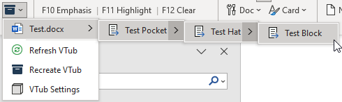

The Virtual Tub allows you to select a cards/blocks from a menu of files in the Ribbon and insert it right into your current document, without having to open the source file. This can make assembling a Speech document much more efficient.

Note that the VTub is really only designed for a handful of select files that you want readily accessible (Theory, 2AC Blocks, Politics 2NC’s, etc...), and not your entire digital collection of files. The more files you try and throw at it, the more likely it will fail.

To use the VTub, open the Verbatim Settings and go to the VTub tab. Set a location where have a small number of files you want in your VTub, then click the "Create VTub" button.

Once the VTub is created, the Virtual Tub menu on the ribbon will have a menu of all the files in the tub. Selecting any file will open up a menu with the headings contained in the file. Clicking on a particular heading will insert it at the cursor.

The VTub will display the internal heading structure of the file down to the Heading 3/Block level, so it can only be used to paste in a Block at a time, not individual cards. If a file appears in the menu completely grayed out, odds are that it doesn’t include any headings.

The VTub does better with smaller files – if you’re trying to use a 2MB case neg and it fails, try using smaller files.

Using the VTub will conflict with the “Use NavPaneCycle at Startup” option you should disable this in the Verbatim settings if you're going to use the VTub.
