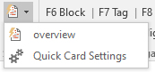

Quick Cards are like a mini-Virtual Tub, designed to let you insert frequently used blocks/cards/analytics just by typing a shortcut word or phrase and then pressing a keyboard shortcut.

For example, you could configure a shortcut with the word "overview". Then, you can type the word "overview", press `Ctrl/Cmd + Alt + Shift + V`, and it will replace the word with your entire overview block. Or, you can insert quick cards using the menu on the ribbon:

To configure, open the Settings from the Quick Cards menu:

Note that you can organize your Quick Cards into one of ten different "Profiles." This lets you quickly switch between different sets of Quick Cards, for example between Aff and Neg, or two different Affs. Once you've selected a Profile, select a block, card, or selection of text in your document and click "Add." It will prompt you for a shortcut word to use for the Quick Card.

Once you've added a Quick Card, you can close the Settings, and insert the card either from the menu or using the keyboard shortcut. To use the shortcut, type the word you chose and press `Ctrl/Cmd + Alt + Shift + V`. Note that the shortcut word is case sensitive and has to exactly match the word you used to create the Quick Card. The cursor should also be right at the end of the word you typed, or Word won't know what to replace.

It's suggested you make your shortcut words short and memorable to avoid confusion. For example, "condo" is a better Quick Card name than "ALongBlockForAffNumber3".

Note that using a large number of Quick Cards may slow down Verbatim. If you're having performance issues, try deleting some.

Under the hood, Quick Cards use Word's autocorrect feature. That means that you may see a popup notification while typing a shortcut word that will let you press Tab to insert the Quick Card rather than the normal keyboard shortcut. The exact number of characters you have to type to allow autocorrect to work with the Tab key is up to Word and may not work in all situations, so it's safest to use the Verbatim-specific shortcut.

To share Quick Cards with other people, you can send them your copy of Debate.dotm. All configured Quick Cards are stored in the master template file.
