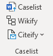
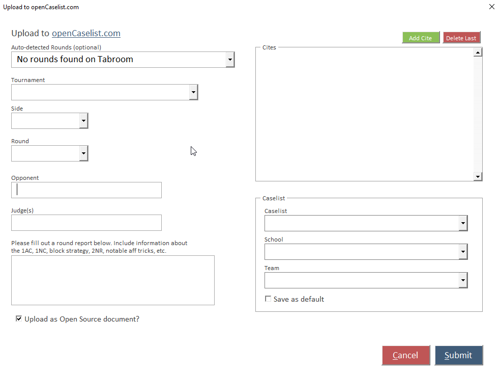

Verbatim is built to work seamlessly with the caselist on opencaselist.com for disclosing your arguments. You will need an account on Tabroom.com for the integration to work. Caselist-related functions are on the Caselist section of the ribbon:

## Upload to openCaselist

The Caselist button on the ribbon will open a form that will help you upload the current document either as cites or as an open source Speech document (or both) to the caselist. It does the cite/wiki conversions for you, so you don’t need to convert them manually before upload.

After the round, assemble a single document with all the cards you read. You should organize this document with a consistent heading structure. By default, Verbatim will attempt to parse cite entries based on the largest heading in the file, so if you use Pockets, each Pocket will become a cite entry. If you only use Block headings, it will parse each block as a separate cite entry, etc.

You can optionally disable auto-parsing of cite entries from the Verbatim settings.

Once you have a combined and organized document, use the Caselist upload form to fill out details about your round, choose whether you want to share the complete document as an Open Source document, then select your caselist, school, and team from the dropdown boxes and click "Submit."

## Citeify Functions

If you want to disclose manually instead of using the built-in uploader, then Verbatim has two built-in macros which make converting cards into a “cite-request ready” format with the tag, cite, and first/last sentence easy. 

To convert a single card, place your cursor in the card and select "Cite Request Card" from the menu, or use the keyboard shortcut `Ctrl/Cmd + Shift + Q`. This will eliminate everything in the text of the card except the first and last few words of the card.

To convert the entire document to a cite-request format, select "Cite Request Doc." This will open a new document with the results of the conversion.

## Wikify Functions

The Wikify button on the ribbon converts everything in your document to cites in ready-to-post wiki syntax for openCaselist. Note that this step is unnecessary if using the built-in "uploader".
