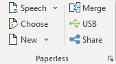
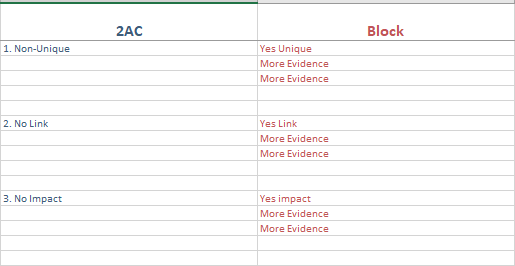
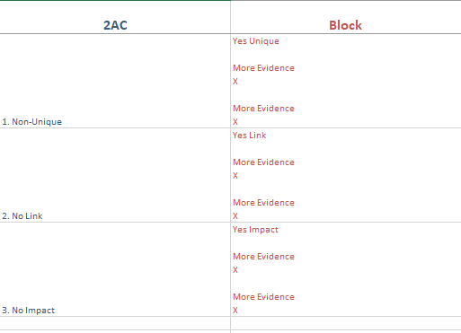
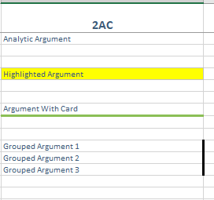
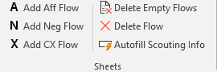

## Getting Started with Verbatim Flow

Verbatim Flow is a template for Microsoft Excel designed for flowing on your computer. It is installed automatically by the automatic installers, or can be installed manually by placing Debate.xltm in the same Templates folder as the Word template. When using the template, all functions appear on the Debate tab on the ribbon.

To create a new flow, use the "New" menu in Verbatim in Word, or open Excel and create a new spreadsheet based on the Flow template.

When you first open a Verbatim Flow spreadsheet, you'll see the Scouting Info page. You can use this page to fill out details about the round and keep track of your different flows.

Then, you can use the functions on the Debate ribbon to create flows and get started flowing.

## Should I use this?

As a judge, minimal downside.

As a debater, honestly, maybe not. There are many advantages of flowing on paper. It gives you a better overview of the entire debate to spread out multiple flowsheets, it helps your brain with argument recall, and written shorthand encourages less typing and more argument construction.

That said, if you're set on flowing on your computer, Verbatim Flow is likely to give you a much better experience than just a default Excel spreadsheet.

## Flowing Style

There are two different ways to use a spreadsheet to flow. One is to treat the spreadsheet similar to a paper flow, and create space between arguments by adding blank rows, much as you might leave physical space between arguments on paper. The other is to use one row of the spreadsheet per argument, keep all points about that argument in the same row, and separate arguments in each speech with line breaks inside the cell. Here's an example of the two different approaches:

### Paper Style

### Row Style

The advantage of the paper style is that it more closely mimics paper flowing, and inserting rows is easy to move space around. The downside is that it can be difficult to see at a glance which arguments respond to earlier arguments in a linear fashion.

The advantage of row style is that it makes it more obvious what arguments respond to the original argument. The downside is that long cells can become unwieldy, and it can be slightly less intuitive in typing.

Which you prefer is up to you, and Verbatim Flow support both. Option #1 is probably more common, but Option #2 is also easier with Verbatim Flow because it includes an "Insert Mode" option which changes the default behavior of the Enter key to insert a linebreak within the cell, which makes it easier to keep typing inside a single cell. Give both a shot and see which one you like better.

## Flow Integrations in Word

Verbatim in Word includes some integrations with Verbatim Flow to facilitate transferring arguments from your speech to your flow. To use, your flow must have the word "Flow" in the name. Then, access the functions from the blue arrow menu in the Speech section of the ribbon or using the associate keyboard shortcut.

**Send To Flow (Cell)** - Sends the current selection (or current Card/Block/Hat/Pocket) to the current cell in Excel, all in a single cell.

**Send To Flow (Column)** - Sends the current selection/heading to the current column in Excel, and separates each paragraph into a separate cell.

**Send Headings To Flow (Cell)** - Sends only headings/tags and last/name date of cites to Excel in the active cell. Helpful to transfer only an outline of the arguments.

**Send Headings To Flow (Column)** - Sends only headings/tags and last/name date of cites to Excel into the current column, separating each paragraph into a separate cell.

## Speech Functions

The Speech section of the ribbon includes functions which let you send arguments to your Speech document in Word, or make it easy to insert prepared analytics/blocks.

**Send To Speech (`/~ Key)** - The blue arrow button sends the contents of the currently selected cell(s) to your Speech document in Word. Note that it can only send to the most recently opened Speech document, rather than the document designated as "active" in Word, so make sure you only have one Speech document open at a time when using this function.

**Send To Speech End (Alt + `/~ Key)** - Same as above, excepts sends to the end of the Speech document rather than the cursor position.

## Quick Analytics

The Quick Analytics function is similar to the [Quick Cards](../debating-paperless/quick-cards) feature in Word. It allows you to save arguments on your flow for later use by typing a shortcut word and then pressing a keyboard shortcut or using the menu to insert them:

To use, open the Quick Analytics settings, select a "Profile", which lets you group arguments by category (e.g. Aff and Neg, or two different Affs), select one or more cells in a single column, and click "Add." It will prompt you for a shortcut word to use.

To insert a Quick Analytic, type the shortcut word in a cell, which is case sensitive and must match exactly. Then, with your cursor on the cell, press the shortcut key (Ctrl + Alt + Shift + V) and it will convert the cell into your saved Quick Analytic. Note that you may need to press the shortcut key twice in a row to get the macro to work.

## Cell Formatting Functions

The Cells section of the ribbon lets you format a cell or group of cells on your flow.

**Insert Cell Above (F3)** - Inserts a cell above the cursor, only in the same column

**Insert Cell Below (Alt + F3)** - Inserts a cell below the cursor, only in the same column

**Merge Cells (F4)** - Combines the content of all selected cells into the active cell, and clears the contents of any other selected cells. Useful for keeping arguments together you want in the same cell.

**Toggle Highlighting (F11)** - Toggles highlighting on the current cell(s), useful for marking an argument as important

**Toggle Evidence (F7)** - Toggles marking the current cell(s) as having a card/evidence associated with it

**Toggle Group (F8)** - Toggles marking the current cell(s) as grouped together, useful for noting when a set of arguments are being responded to together

An example of the previous three cell formats:

**Extend Argument (F9)** - Copies the contents of the current cell two columns to the right, for use in a later speech. Can optionally be configured in the Verbatim settings to use an arrow instead of the cell content.

## Row Formatting Functions

The Rows section of the ribbon lets you manipulate your flow a row at a time.

**Insert Row Above (F5)** - Inserts an entire row above the current row

**Insert Row Below (Alt + F5)** - Inserts an entire row below the current row

**Delete Row (Ctrl + Alt + F5)** - Delete the entire current row

**Move Selection Up (Ctrl + Alt + Up)** - Moves the selection up a row, moving any content above it down a row

**Move Selection Down (Ctrl + Alt + Down)** - Moves the selection down a row, moving any content above it up a row

**Go To Bottom (Ctrl + Alt + Shift + Down)** - Moves the cursor to the last argument in the current column

## Sheet Formatting Functions

The Sheets section of the ribbon has functions to add or delete entire flowsheets.

Note that by default, sheets will be renamed on the fly based on the content of cell A2. That cell will be active when first moving to a sheet, so if the first thing you type on each flow is the name of the sheet (e.g. Example DA), the sheet will be renamed to match.

**Add Aff Flow (Ctrl + Alt + A)** - Add an Aff Flow

**Add Neg Flow (Ctrl + Alt + N)** - Add a Neg Flow

**Add CX Flow (Ctrl + Alt + X)** - Add a CX Flow

**Delete Empty Flows** - Automatically removes any flows with no arguments

**Delete Flow** - Deletes the current flow. Prompts first if there's any arguments.

**Autofill Scouting Info** - Automatically fills out the Scouting Info sheet based on the titles of the flows in the round.

## Insert Functions

Insert functions on the ribbon are useful when using the "Row Style" of flowing described above.

**Enter Cell (F2)** - Puts the cursor at the bottom/end of the content of the current cell. Faster than double clicking to edit the cell and then using the arrow keys to navigate through the existing cell content.

**Toggle Insert Mode** - When turned on, changes the default behavior of the Enter key to insert a line break inside the current cell. This lets you flow all arguments related to a single argument in the same cell easily. When you want to leave the cell and move to a different one, first press the Esc key to exit edit mode, then use your arrow keys or mouse to move to a different cell. To turn off, press the button on the ribbon again.

**Paste Unformatted (F6)** - Pastes the contents of the clipboard as unformatted text.

## View Functions

The View section of the ribbon has functions to help setup your screen or easily move between speeches.

**Zoom Functions** - Changes the current zoom level of the current sheet, or returns it to the default 100% zoom.

**Switch Speech** - This menu lets you automatically move the cursor on each sheet to the top of the column for the selected speech, so you don't have to move it manually on each one. Most useful to run right after reorganizing the sheets by dragging and dropping, after the speaker has given their order but not yet started speaking. The speech names are configurable in the Verbatim Flow settings.

**Split With Word** - Puts the flow on the left half of the screen, and any Speech document open in Word on the right side of the screen.

## Settings Functions

The Settings section of the ribbon lets you open a shortcut cheatsheet or the Verbatim Flow settings.

**Cheat Sheet (F12)** - Opens a handy cheatsheet of the Verbatim Flow keyboard shortcuts.

**Settings** - Opens the Verbatim Flow settings for customizing your flow preferences.

## Customizing Verbatim Flow

The Verbatim Flow settings have several options for customizing the behavior of the template:

**Use Insert Mode on Start** - When checked, turns on Insert Mode as soon as you open a new flow.

**Use Arrow for Extending Argument** - When checked, places an arrow in the next column when extending arguments, rather than copying the contents of the current cell(s).

**Auto Label Flows From A2** - When checked, changes the label of each flow to match whatever you type in cell A2. When disabled, you'll need to label each flow manually.

**Disable Sheet Name Popup** - By default, Verbatim Flow will briefly pop up the name of the sheet you're switching to when you switch between flows. The popup will disappear after a second. If you want to disable seeing these entirely, check this option.

**Freeze Speech Names When Scrolling** - When checked, the top row with the name of each speech will be locked into place when scrolling down the flow.

**Use alternate tilde shortcut method** - Only check this if you have trouble with the tilde key shortcuts working on your computer. It will try an alternate method of assigning the keyboard shortcuts that may help on some laptop models.

**Speech Names** - A list of speech names on each flow sheet. Should be a comma separated list with no space between names. Alternately, use the dropdown menu to select a preset for the most common debate formats.

**Font Size** - Sets the default font size for each flow sheet.

**Row Height** - Sets the default row height for each flow sheet.

**Column Width** - Sets the default column width for each flow sheet.

## Keyboard Shortcuts

Unlike in Word, it's not currently possible to use the Command key for shortcuts in Excel. As such, the Control key is used on both Mac and PC.

### Speech Shortcuts
**Send To Speech** - `/~ Key

**Send To Speech End** - Alt + `/~ Key

**Insert Quick Analytic** - Ctrl + Alt + Shift + V

### Cell Shortcuts
**Insert Cell Above** - F3

**Insert Cell Below** - Alt + F3

**Merge Cells** - F4

**Toggle Highlighting** - F11

**Toggle Evidence** - F7

**Toggle Group** - F8

**Extend Argument** - F9

### Row Shortcuts
**Insert Row Above** - F5

**Insert Row Below** - Alt + F5

**Delete Row** - Ctrl + Alt + F5

**Move Selection Up** - Ctrl + Alt + Up

**Move Selection Down** - Ctrl + Alt + Down

**Go To Bottom** - Ctrl + Alt + Shift + Down

### Sheet Shortcuts
**Add Aff Flow** - Ctrl + Alt + A

**Add Neg Flow** - Ctrl + Alt + N

**Add CX Flow** - Ctrl + Alt + X

**Next Flow** - Ctrl + PgUp

**Previous Flow** - Ctrl + PgDown

### Insert Shortcuts
**Enter Cell** - F2

**Paste Unformatted** - F6

### Settings Shortcuts
**Show Cheat Sheet** - F12