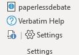

Keyboard shortcuts are the best way to improve your efficiency using Verbatim. You can open a cheatsheet with the entire list in Verbatim from the button in the lower left of the Settings section of the ribbon.

Below is a list of the default keyboard shortcuts. Note that the Ctrl key is used on PC, while the Command key is used on Mac.

Shortcuts can be customized in the Verbatim settings. The F-key shortcuts can choose from a list of macros, or you can use the Advanced settings to change any shortcut.

To help in remembering the shortcuts, here are a few general guidelines:

Shorcuts with "Alt" + a key are usually an "alternate" way of doing the function for the main key. For example, F3 condenses text, while Alt + F3 condenses text without pilcrows.

Shortcuts with "Ctrl" + a key are usually a way of automating or running a macro associated with the function for the main key. So F8 is cite style, while Ctrl + F8 auto-formats your citation.

Shortcuts using the `/~ key are for "sending" content to different locations, both in Word and Verbatim Flow in Excel.

## Default Shortcuts

### Speech Shortcuts

**Send To Speech/Mark Card** - \` or Ctrl/Cmd + Alt + Right

**Send To Speech End** - Alt + \` or Ctrl/Cmd + Alt + Shift + Right

**Send To Flow (Cell)** - Ctrl + G or Ctrl + \`

**Send To Flow (Column)** - Ctrl/Cmd + Alt + G or Ctrl/Cmd + Alt + \`

**Send Headings To Flow (Cell)** - Ctrl/Cmd + Shift + G or Ctrl + ~

**Send Headings To Flow (Column)** - Ctrl/Cmd + Alt + Shift + G or Ctrl/Cmd + Alt + ~

**Insert Quick Card** - Ctrl/Cmd + Alt + Shift + V

### Core Organize/Format Shortcuts

**Verbatim Help** - F1 or Ctrl/Cmd + Alt + 1

**Paste Text** - F2 or Ctrl/Cmd + Alt + 2

**Condense** - F3 or Ctrl/Cmd + Alt + 3

**Pocket** - F4 or Ctrl/Cmd + Alt + 4

**Hat** - F5 or Ctrl/Cmd + Alt + 5

**Block** - F6 or Ctrl/Cmd + Alt + 6

**Tag** - F7 or Ctrl/Cmd + Alt + 7

**Cite** - F8 or Ctrl/Cmd + Alt + 8

**Underline** - F9 or Ctrl/Cmd + Alt + 9

**Emphasis** - F10 or Ctrl/Cmd + Alt + 0

**Highlight** - F11 or Ctrl/Cmd + Alt + -

**Clear Formatting** - F12 or Ctrl/Cmd + Alt + =

**Shrink** - Alt + F3 or Ctrl/Cmd + 8

### Format Shortcuts

**Condense With Pilcrows** - Ctrl/Cmd + Alt + F3

**Condense No Pilcrows** - Ctrl/Cmd + F3

**Uncondense** - Ctrl/Cmd + Alt + Shift + F3

**Auto Format Cite** - Ctrl/Cmd + F8

**Copy Previous Cite** - Alt + F8

**Auto Underline** - Alt + F9

**Auto Emphasize First** - Ctrl/Cmd + Alt + F10

**Update Styles** - Ctrl/Cmd + F12

**Select Similar** - Ctrl/Cmd + F2

**Get From Cite Creator** - Alt + F2

**Auto Number Tags** - Ctrl/Cmd + # (Ctrl/Cmd + Shift + 3)

### Organization Shortcuts

**Move Up** - Ctrl/Cmd + Alt + Up

**Move Down** - Ctrl/Cmd + Alt + Down

**Move To Bottom** - Ctrl/Cmd + Alt + Shift + Down

**Select Heading** - Ctrl/Cmd + Alt + A

**Delete Heading** - Ctrl/Cmd + Alt + Left

### Paperless Shortcuts

**New Speech** - Ctrl/Cmd + Shift + N

**Copy To USB** - Ctrl/Cmd + Shift + U

**Share to Tabroom** - Ctrl/Cmd + Shift + S

### Tools Shortcuts

**Start Timer** - Ctrl/Cmd + Shift + T

**Document Stats** - Ctrl/Cmd + Shift + I

### View Shortcuts

**Run NavPaneCycle** - Ctrl/Cmd + Shift + W

**Arrange Windows** - Ctrl/Cmd + Shift + Tab

**Cycle Windows** - Ctrl/Cmd + Tab

**Invisibility Off** - Ctrl/Cmd + Shift + V

**Toggle Reading View** - Ctrl/Cmd + Alt + R

### Caselist Shortcuts

**Cite Request Card** - Ctrl/Cmd + Shift + Q

### Settings Shortcuts

**Verbatim Settings** - Alt + F1
