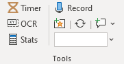
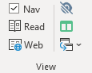

The Tools section of the ribbon has a few helpful utilities for cutting evidence or debating paperless.

### Timer

Opens an on-screen speech/prep timer. Installation of the Timer is described in the section on [Plugins](./plugins).

### OCR

Takes a screenshot and converts it to text, for e.g. easier cutting of PDFs. Requires installing the OCR Plugin, described in [Plugins](./plugins).

### Stats

Opens a popup with key stats about the current document, including an estimate of how long it will take you to read it. Your words-per-minute can be configured in the Verbatim Settings.

### Record

Starts an audio recording using your computers microphone. When turned off, will save the recording to your Desktop folder or alternate location configured in the Verbatim settings.

### Auto-Open Folder

If you configure an Auto-Open Folder in the Verbatim settings, Word will open any file that appears in that folder immediately. This can be useful when for example configured to point to a Dropbox folder. Then, your partner can place a document in the folder and it will open on your computer automatically. This can be used to do things like put a card at the bottom of your partners speech without them needing to pause their speech to find and open a file.

### NavPaneCycle (PC only)

Runs the NavPaneCycle utility to cycle between the heading levels displayed on the Word Navigation Pane. Requires the NavPaneCycle [Plugin](./plugins).

Word’s Navigation Pane is very powerful, but can sometimes be very cluttered, especially in long files making full use of all four Verbatim heading levels. Unfortunately, the NavPane cannot be automated from within Word, and cannot be set to open “collapsed” to only Heading 1.

The first alternative is to manually change which Heading Levels are displayed in the Navigation Pane by right clicking anywhere in it and selecting “Show Heading Levels – Show Heading X.”

The downside of this approach is that it’s slow and repetitive. To cover this gap until an official Microsoft solution, I’ve written a standalone program that cycles them. To use, you can either use the built-in shortcut key, or press the NavPaneCycle button on the ribbon.

The macro will take about a half second each time you press the shortcut (and you have to release both keys first). It will only work when Word is the active window, and when the Nav Pane is open.  Otherwise, it will do nothing.

**IMPORTANT NOTE**: It’s possible that NavPaneCycle will not work on your computer – if you find that it consistently doesn’t click in the right place to cycle the Nav Pane, or accidentally "demotes" sections of your file instead, then you’re probably out of luck.

You can also set an option in the Verbatim settings which will run NavPaneCycle automatically every time you open a new file, condensing the Nav Pane to only show Heading 1. This is somewhere between very convenient and very annoying, depending on how you look at it. Note that this sometimes conflicts with using the Virtual Tub – it’s not recommended you use both simultaneously.

### Add Warrant

Lets you add and remove "warrants" from parts of your document. Think of these like sticky notes you can put next to cards. They will appear alongside your document when in reading view, and let you do things like make a list of warrants in a particular card for reference during a rebuttal.

### Search

To use the built-in search, type a search term in the box and press Enter. Then, select the dropdown menu next to the box to see a list of matching files. By default, it will search in your Documents folder, but this can be configured in the Verbatim settings.

Search works slightly different on PC vs Mac. On the PC, search uses Windows Explorer and can search inside the contents of your files, though the relevance of results is sometimes questionable. It also gives you options to repeat your search for more results in Windows Explorer.

Optionally, you can use the Everything Search [Plugin](./plugins) to repeat your search in Everything Search. Clicking the button in the results menu will launch Everything Search with your search terms already loaded. Note that by default Everything only searchs file names/paths, so if you want to also search in the contents of files (which can be slow), you need to manually add `content:` to the beginning of your search in Everything.

On the Mac, search uses the default Mac OS Spotlight search, which may have mixed results searching in file content.

### Invisibility Mode

Invisibility Mode is on the View section of the Ribbon:

When turned on, Invisibility Mode will hide all text in your document except headings/tags, cites, and highlighted text. This can condense a long multipage speech document into just one or a few pages, making reading your highlighted card text much easier. To turn it back off and display all text again, just click the button again.

This can also be used by judges to avoid reading the un-underlined portions of cards, and only evaluate the portions actually read in the round.
