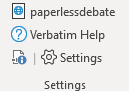

Verbatim is designed to be extremely customizable via the Verbatim Settings, which can be opened by pressing `Alt + F1` or using the Settings button on the ribbon:

This section will explain each option in the Verbatim Settings.

## Profile Settings

**Name/School Name** - these are used when inserting a header for printable files, or when exporting custom settings for use by other people.

**Event** - controls the default length of speech in the Stats form.

**Words Per Minute** - used to estimate the length of your Speech document on the Stats form.

**Tabroom.com** - Shows the current state of whether you're logged into Tabroom in Verbatim, and lets you Login or Logout, or disable Tabroom integrations entirely. Note that disabling Tabroom integration will mean you can't use the Caselist upload or Share to share.tabroom.com features.

## Admin Settings

**"Always On" Mode** - when enabled, will add the Debate ribbon and Verbatim styles to every document opened in Word. When turned off, you can still use the "Verbatimize" button on the Home tab of the Ribbon to convert any document to a Verbatim document

**Auto Update Styles** - When opening a Verbatim file produced by someone else, will update the document to match your current style configuration (e.g. fonts, font sizes, etc.)

**Suppress Style Checks** - By default, Verbatim will attempt to stop Word from creating extraneous styles by itself that can junk up your document. This allows you to disable that behavior.

**Suppress Installation Checks** - Will prevent checking whether Verbatim is installed correctly on start.

**Suppress .doc check** - Will prevent checking whether the default save format is using the more modern .docx format, which is preferred in most situations to the older .doc

**Reset First Run** - Will set a flag telling Verbatim that this is the first time you've run the program, causing things like the Setup Wizard to appear on the next start.

**Setup Wizard** - Launches the setup wizard that helps with a few initial settings

**Troubleshooter** - Launches the Verbatim troubleshooter, which will check for installation issues, known setup problems, etc.

**Tutorial** - Launches the built-in Verbatim Tutorial, which will walk you through the major Verbatim features.

**Un-Verbatimize Normal Template** - Only necessary if you used to use Verbatim 5.x and had "Verbatimized" your Normal Template to enable Always On mode. Verbatimizing the Normal template is no longer necessary, so this is only needed to fix issues with past installations or if you have multiple "Verbatimize" buttons appearing on the Home tab of the ribbon.

**Import/Export Settings** - Imports or exports a Verbatim settings file, for sharing your setup with other people.

**Import/Export Custom Code** - Imports or exports a "Custom" VBA code module, for sharing VBA macros you've written with other people.

## View Settings

**Default View** - Whether to open in Draft or Web view. Web view is generally preferable, but Mac has issues with Web view when the Navigation Pane is open, so Draft view is recommended for Mac users.

**Run NavPaneCycle** - Whether to run NavPaneCycle automatically every time a document is opened, to attempt to collapse to only showing Heading 1.

**Auto Arranger Screen Setup** - Configures how much of the screen to use for your Speech docuement or non-speech files when automatically arranging your windows. Small screens usually benefit from overlapping the documents more than 50%, while leaving just enough on each side to make switching between them easy.

**Hide Debate Ribbon Groups** - When checked, hides the corresponding section of the Debate ribbon. Useful if you have a small screen that collapses sections by default, or for only showing the functions you use most frequently.

## Paperless Settings

**AutoSave** - Configure the directory where speech documents and flows are saved automatically.

**Strip Speech When Sharing** - When checked, automatically removes the word "Speech" from your file when sharing on share.tabroom.com or copying to a USB drive.

**Default Search Directory** - Which folder (including subfolders) to run the built-in search function.

**Auto Open Directory** - Configure a folder to use as an "Auto Open" folder, which will cause any documents placed in that folder to be opened automatically in Word.

**Audio Recordings Directory** - Where to save audio recordings made using the Record function on the ribbon.

## Styles Settings

This section lets you configure the font size and format for built-in Verbatim styles, change the default font, and choose how Cite, Underline, and Emphasis styles appear.

Note that styles set here will make Verbatim files you open appear with these styles, but still allow other people with different settings to view the files in their own settings.

## Format Settings

**Shrink Omissions** - Whether to shrink omission notes in card text, e.g. [ Table Omitted ] when using the Shrink functions.

**Spacing** - Whether to use the default paragraph spacing used since v5, or revert to the older paragraph spacing styles from Verbatim 4.

**Retain Paragraphs** - Whether to retain paragraph integrity when using the Condense (F3) function. When off, will collapse all paragraphs into a single paragraph. When on, behavior depends on your setting for Use Pilcrows. Can also be toggled directly from the Debate ribbon.

**Use Pilcrows** - When using "Retain Paragraphs," will replace paragraph breaks with a pilcrow symbol when using Condense (F3). Can also be toggled directly from the Debate ribbon.

**Condense On Paste** - Whether to condense paragraphs automatically when using the Paste Text (F2) function.

**Auto Emphasis** - Whether to always use Emphasis style when underlining with Underline (F9). Note that this essentially makes the Underline and Emphasis styles the same.

**Standardize Highlighting Exception** - Used with the Standardize Highlighting With Exception function in the Format menu, sets a highlighting color to ignore when standardizing highlighting to the currently selected highlighting color.

## Keyboard Settings

This section lets you switch which macro each F-key is mapped to. Only some macros can be used as an F-key shortcut. For more advanced control over all keyboard shortcuts, you can use the "Other Shortcuts..." button.

**Fix Tilde** - Useful if you are having issues with your `/~ key not responding to keyboard shortcuts, especially common when using Boot Camp to run Windows on a Mac.

## VTub Settings

**Virtual Tub Path** - The path to a folder you want to use as your VTub. Recommended to only use a small number of files, not set to your entire tub.

**Prompt to Auto Refresh** - Whether to automatically prompt you to refresh your VTub when it detects changes to files in the VTub. Turning this off may cause unpredictable behavior when inserting blocks from changed files.

## Caselist Settings

**Upload Open Source by default** - Whether to default to uploading your entire document to opencaselist.com as an Open Source entry.

**Process document for cites by default** - Whether to attempt splitting your document into cite entries when opening the Upload to Caselist form. When off, cite entries can still be created manually.

## Plugins Settings

**Path to Timer application** - Configures the path to an executable launched when you click the Timer button on the ribbon. Will automatically find the Verbatim Timer if installed to the default Plugins location, but can be used if you installed somewhere different or want to launch a different timer application instead.

**Path to OCR application** - When set, will launch an external executable when the OCR button on the ribbon is clicked, instead of using the Verbatim OCR Plugin.

**Path to Search application** - When set, will launch an external executable when the Search results menu is clicked, instead of using the built-in Search or Everything Search integration. Note that custom search applications don't have the search terms passed to them, so a custom integration is limited to just launching the external program.

## About Settings

**Verbatim Help** - Opens the Verbatim Help menu with options to launch the Tutorial, Troubleshooter, etc.

**Automatically Check for Updates** - Whether to check paperlessdebate.com for updates to Verbatim once a week on Wednesday. When updates are found, will prompt you to download the latest version of Verbatim.

